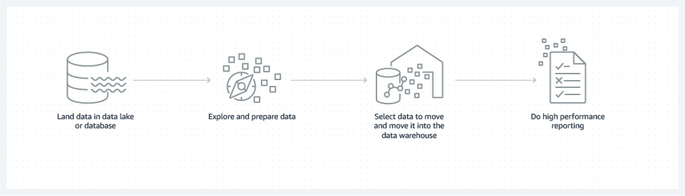
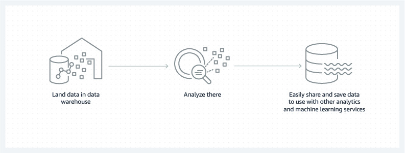

> A data warehouse is a central repository of information that can be analyzed to make more informed decisions. Data stored in the data warehouse comes from transactional systems, relational databases , and other sources, and typically arrives at regular intervals. Business analysts, data engineers, data scientists, and executives access data through Business Intelligence (BI) tools , SQL clients, and other analytics applications.
> 
> Data and its analysis are essential for companies that want to stay competitive. Business users use reports, dashboards, and analytics tools to leverage their data, monitor performance, and support decision-making. These reports, dashboards and analysis tools are powered by Data Warehouses, which store data efficiently to minimize I/O and deliver query results blazingly fast to hundreds of thousands of online users. same time.

 

#### How is a data warehouse architected?
A data warehouse architecture consists of different tiers. The top tier represents the front-end client that displays results through reporting, analysis, and data mining tools. The middle tier includes the analytics engine used to access and analyze the data. The lowest level of the architecture represents the database server, which is where data is loaded and stored. Data is stored in two different ways: 1) frequently accessed data is stored in very fast storages (such as SSDs) and, 2) infrequently accessed data is stored in inexpensive object storages, such as Amazon S3. The data warehouse

#### How does a data warehouse work?
A data warehouse can contain multiple databases. In each of them, the data is organized in tables and columns. In each column, you can define a description of the data, such as an integer value, a data field, or a string. Tables are organized inside schemas, which can be considered as a kind of folder. When the data is integrated, it is stored in different tables described by the schema. Search tools use this schema to determine which tables can be searched and analyzed.

#### What are the benefits of using a data warehouse?
The benefits of a data warehouse include:

-Informed decision making
-Consolidated data from different sources
-Analysis of historical data
-Data quality, consistency and accuracy
-The separation of analytical processing and transactional -databases, which improves the performance of both systems.

#### How do data warehouses, databases, and data lakes work together?
Typically, businesses use a combination of database, data lake, and data warehouse to store and analyze data. Amazon Redshift 's Lake House architecture facilitates such integration.

With the volume and variety of data increasing, it pays to follow one or two common patterns for working with data across your database, data lake, and data warehouse:

 

A data warehouse is designed specifically for analyzing data, which involves reading large amounts of data with the goal of understanding the relationships and trends between that data. A database is used to capture and store data, by recording details related to a transaction, for example.

Unlike a data warehouse, a data lake is a centralized repository for all data, including structured, semi-structured, and unstructured data. A data warehouse requires data to be organized in a tabular format, and this is where the schema comes in. The tabular format is necessary so that SQL can be used to query the data. However, not all applications require the data to be in a tabular format. Some applications, such as big data analytics, full-text search, or machine learning can access data even if it is semi-structured, or completely unstructured.

